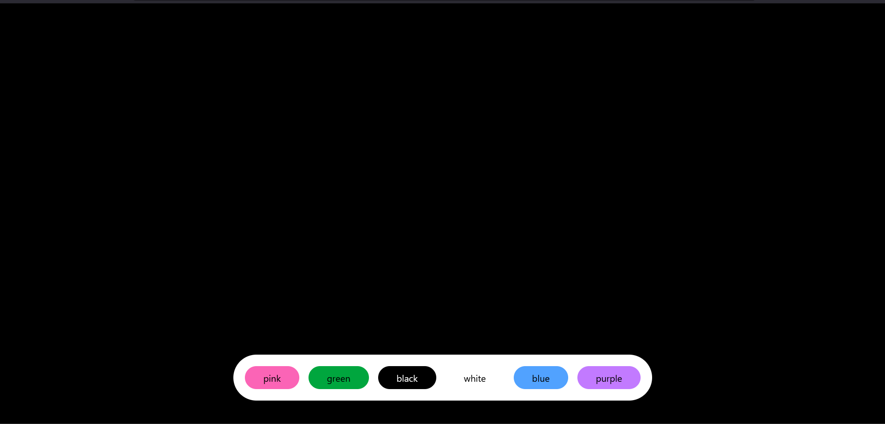

# React Color Picker

Can you guess what this mini React project does? 🤔

Here's a hint: It involves colors and interaction! 🎨 

Take a moment to think about how you might build a simple color-related feature in React. What components would you use? How would you manage state?

**Project Overview**

This is a simple React application that allows you to change the background color of the screen by clicking on different color buttons. It demonstrates basic state management and event handling in React.

Here is the example

---

Once you have an idea, feel free to explore the code and see how it's implemented. You can run the project by following these steps:

1. Clone the repository: `git clone <repository-url>`
2. Navigate to the project directory: `cd react-color-picker`
3. Install dependencies: `npm install`
4. Start the development server: `npm start`

This will open the app in your web browser, and you can see how it works!

---

**Technologies Used**

* React
* JavaScript
* CSS

**Contributing**

Contributions are welcome! Feel free to open an issue or submit a pull request.

**License**

This project is licensed under the MIT License.
